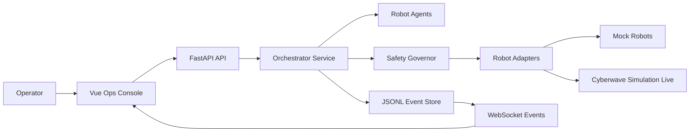

# Piano Console Orchestrazione Robot

## Stato Attuale

- La UI non esiste ancora: il progetto ha solo backend Python/CLI in [`safeground/cli.py`](safeground/cli.py).
- Gli agenti esistono solo a livello P0 rule-based in [`safeground/agents.py`](safeground/agents.py): `CommandInterpreterAgent` e `OrchestratorAgent` convertono testo in intenti sicuri, ma non fanno ancora pianificazione multi-robot capability-aware.
- I comandi robot già disponibili in codice sono solo mock/safe: `capture_frame`, `stop`, `hold_position`, esposti da [`safeground/adapters.py`](safeground/adapters.py) e validati da [`safeground/safety.py`](safeground/safety.py). I comandi reali Cyberwave sono documentati ma non cablati nel codice applicativo.
- I modelli anticipano il multi-robot: [`safeground/models.py`](safeground/models.py) include `RuntimeMode.MOCK/SIMULATION/LIVE` e stati come `SECOND_OBSERVATION`, `CONSENSUS`, `HUMAN_REVIEW`, ma [`safeground/mission.py`](safeground/mission.py) oggi percorre solo `OBSERVE -> CLASSIFY -> REPORT`.

## Architettura Proposta

- Backend: aggiungere una superficie FastAPI in `safeground/api/` con REST per missioni/robot/azioni e WebSocket per eventi real-time.
- Frontend: creare `frontend/` con Vue/Vite, TypeScript, layout scuro stile operations console: mission header, fleet panel, risk map, camera/classification panel, timeline audit, command palette e stop sempre visibile.
- Orchestrazione: estrarre una service layer riusabile dalla CLI, così UI e CLI condividono `MissionRunner`, `JsonlEventStore`, `SafetyGovernor`, CV mock e adapter.
- Safety: mantenere `dry_run=true` come default, mostrare chiaramente `mock/simulation/live`, e bloccare ogni azione non allow-listed.

## Agenti Robot Da Definire

- `MissionOrchestratorAgent`: estende l’attuale `OrchestratorAgent` e assegna task a robot diversi in base a ruolo, stato e capabilities.
- `PrimaryScoutAgent`: usa Go2 o UGV per osservazione primaria, `capture_frame`, stato e raccomandazione.
- `VerificationScoutAgent`: gestisce i casi `UNCERTAIN` con seconda osservazione e transizione verso `SECOND_OBSERVATION`/`CONSENSUS`.
- `MarkerAgent`: SO-101 solo P2 e solo per marker scenici sicuri; mai contatto con target `MINE` o `UNCERTAIN`.
- `OperatorCommandAgent`: consolida chat/voice esistenti e mantiene vocabolario ristretto: start, stop, status, request second look, confirm, mark non-mine.

## Piano Di Implementazione

1. Preparare packaging e dipendenze minime: aggiungere config backend Python per FastAPI/Uvicorn/test e `frontend/package.json` per Vue/Vite/TypeScript.
2. Introdurre un `RobotAdapter` protocol/base e un registry fleet in [`safeground/adapters.py`](safeground/adapters.py), mantenendo `MockRobotAdapter` e aggiungendo mock Go2, UGV, SO101 e camera fissa.
3. Estendere i modelli in [`safeground/models.py`](safeground/models.py) con `RobotStatus`, `RobotCapabilityMap`, `Observation`, `Finding`, `CommandRequest`, `MissionSnapshot` e coordinate di mappa demo.
4. Creare `safeground/services/orchestrator_service.py` per avvio missione, stop, status, replay eventi e bridge verso `MissionRunner`.
5. Aggiungere `safeground/api/server.py` con endpoint compatibili con i docs: `/api/missions`, `/api/robots`, `/api/observations`, `/api/events`, `/ws/events`, più `/api/commands` per command palette.
6. Estendere [`safeground/event_store.py`](safeground/event_store.py) con lettura eventi, snapshot e subscriber async per WebSocket senza perdere il JSONL audit trail.
7. Implementare il primo flusso P1 mock in [`safeground/mission.py`](safeground/mission.py): se la classificazione è `UNCERTAIN` o `SECOND_VIEW`, assegnare `VerificationScoutAgent`, catturare secondo frame mock e produrre consenso o human review.
8. Creare la Vue ops console in `frontend/src/` con componenti: `MissionHeader`, `RobotFleetPanel`, `RiskMap`, `CameraPanel`, `ClassificationCard`, `EventTimeline`, `CommandPalette`, `SafetyControls`.
9. Applicare lo stile Gotham/Palantir “non evil”: dark mode tecnico, griglia dati, mappe e timeline dense, ma copy orientato a auditability, humanitarian safety, human-in-the-loop e bounded autonomy.
10. Aggiungere test backend per API, registry robot, evento WebSocket/replay, stop all e flusso `UNCERTAIN -> SECOND_OBSERVATION -> CONSENSUS/HUMAN_REVIEW`; aggiungere una verifica frontend minima di build/typecheck.

## Verifica

- Eseguire test Python nel venv del progetto con `.venv/bin/python -m unittest` o comando equivalente dopo avere registrato le dipendenze.
- Eseguire build/typecheck frontend con `npm run build` o `npm run typecheck`.
- Smoke test manuale: avviare FastAPI, aprire Vue console, lanciare missioni mock `NOT_MINE`, `MINE`, `UNCERTAIN`, verificare timeline real-time e `Stop All`.
- Per Cyberwave live/simulation: lasciare solo hook/adapter preparatori finché non sono confermati twin slug, sensor ID e controller policy onsite.