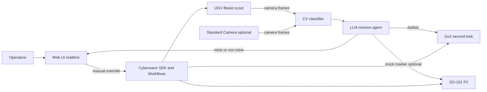

# Piano Documenti MVP Cyberwave Hackathon

## Output Previsti

Creerò due file markdown nel repository:

- [docs/hackathon-mvp-requirements.md](docs/hackathon-mvp-requirements.md): requisiti, priorità e demo plan per un MVP di computer vision che classifica oggetti come `mine`, `non mine`, `dubbio`, con escalation a un secondo robot.
- [docs/robot-sensors-research.md](docs/robot-sensors-research.md): ricerca sulla sensoristica di SO-101, UGV Beast, Unitree Go2 e camera integration, con fonti e note su cosa verificare fisicamente all'hackathon.

## Impostazione Del Requisito MVP

Il documento requisiti sarà orientato a una demo hackathon, non a un prodotto completo. La narrativa proposta sarà:

- UGV Beast o camera fissa osserva l'area e raccoglie frame RGB.
- Un modello CV classifica i target visivi in `mine`, `non mine`, `dubbio`.
- Un agente LLM agisce da mission coordinator: legge detections, confidence, stato robot e decide azioni bounded.
- In caso `dubbio`, il sistema invia un secondo robot, preferibilmente Go2 per una seconda prospettiva mobile; SO-101 resta opzione P2 per marker/manipolazione solo con oggetti mock.
- Web UI mostra feed, bounding box, confidence, stato robot, event log, override umano e kill switch.

Flusso proposto:

## Priorità Da Inserire

Userò una classificazione MoSCoW/P0-P2:

- P0 demo minima: classificazione da feed camera, dashboard realtime, log decisioni, controllo manuale, simulazione o dry-run se l'hardware non è stabile.
- P1 multi-robot: routing automatico dei casi `dubbio` a Go2 o UGV da seconda angolazione, con validazione delle azioni e stop immediato.
- P2 wow factor: SO-101 come marker/collector di oggetti mock, mappa missione, replay dataset, workflow Cyberwave più automatico.
- Out of scope: mine reali, disinnesco, classificazione affidabile di ordigni veri, autonomia non supervisionata in ambiente non controllato.

## Ricerca Sensoristica

Il secondo documento sintetizzerà:

- SO-101: 6 DOF, servo/joint telemetry, leader-follower teleop, wrist camera e/o overhead camera come sensori principali per task visivi. Fonti: tutorial Cyberwave SO-101 e specifiche SO-101/SVRC.
- UGV Beast: camera 5MP 160 degree FOV su pan-tilt, IMU 9 assi, monitor batteria, luci, possibile espansione LiDAR/OAK-D nei kit ROS2. Fonti: Cyberwave UGV voice tutorial e Waveshare/Open Hardware Directory.
- Unitree Go2: LiDAR 4D/3D, camera HD wide-angle, foot force sensors, mic/speaker, con uso Cyberwave per telemetry, occupancy mapping e mission execution. Fonti: Cyberwave Go2 tutorial e Unitree specs.
- Camera Integration: USB/IP/depth/IR/GigE supportate da Cyberwave, RGB/depth/IR se disponibili, `get_frame()`/WebRTC/workflows. Fonti: Cyberwave camera overview, Python SDK, RealSense D455 e Logitech C270 specs.

Annoterò anche il livello di confidenza per ogni informazione, perché alcune pagine hardware Cyberwave dirette hanno richiesto autenticazione nel fetch e vanno confermate sui robot fisici disponibili.

## Fonti Base

Le fonti principali che citerò nei documenti includono:

- [Cyberwave Quickstart](https://docs.cyberwave.com/overview)
- [Cyberwave Python SDK repository](https://github.com/cyberwave-os/cyberwave-python)
- [Cyberwave Python SDK docs](https://docs.cyberwave.com/overview/tools/python-sdk.md)
- [Cyberwave Cameras overview](https://docs.cyberwave.com/overview/cameras.md)
- [Cyberwave SO-101 natural language agent](https://docs.cyberwave.com/tutorials/so101-natural-language-agent.md)
- [Cyberwave SO-101 teleop dataset](https://docs.cyberwave.com/tutorials/so101-teleop-dataset.md)
- [Cyberwave UGV voice controlled tutorial](https://docs.cyberwave.com/tutorials/ugv-voice-controlled.md)
- [Cyberwave Go2 digital to physical tutorial](https://docs.cyberwave.com/tutorials/go2-digital-to-physical.md)
- [Cyberwave Virtual Controller node](https://docs.cyberwave.com/feature-reference/workflows/virtual-controller.md)
- [Unitree Go2 official page](https://unitree-robot.com/go2/index.html)
- [Waveshare UGV Beast wiki](https://www.waveshare.com/wiki/UGV_Beast)
- [SO-101 specifications](https://www.roboticscenter.ai/hardware/so-101/specs)
- [Intel RealSense D455](https://www.intelrealsense.com/depth-camera-d455/)
- [Logitech C270](https://www.logitech.com/en-us/shop/p/c270-hd-webcam)

Nota: il link Notion fornito ha risposto 404 nel fetch automatico; se è accessibile da browser con sessione autenticata, lo userò come fonte supplementare dopo conferma/accesso.