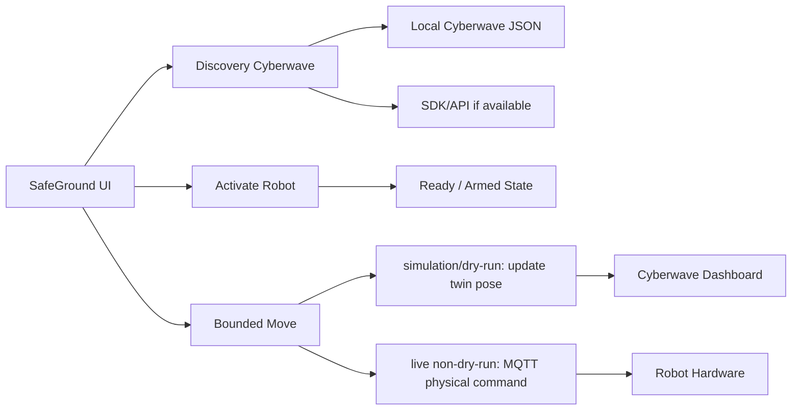

# Robot Activation Cyberwave

## Contesto Rilevato
- Cyberwave locale ha `Default Environment` con 4 twin: `Unitree Go2`, `UGV Beast`, `SO-101 Go2`, `SO-101 UGV`.
- I feed attivi in `/Users/angry/.cyberwave/camera_streams.json` sono Go2 (`758bee49...`, porta `8091`) e UGV Beast (`8a40ed9f...`, porta `8092`).
- SafeGround ha già runtime `mock/simulation/live`, micro-movimenti base bounded, SO-101 takeover, `GET /api/robots/{robot_id}/latest-frame`, e MQTT live per movimenti fisici.

## Strategia
Implementare un `Robot Activation Center` safety-first:

## Backend Changes
- In `/Users/angry/personal/hackaton/safeground/models.py` add models for:
  - Cyberwave discovered twin metadata: uuid, display name, registry id, stream status, available actions.
  - Robot activation state: `available`, `ready`, `armed`, `activation_mode`, `physical_enabled`, `virtual_enabled`, `last_check`.
  - Requests/results for activation and virtual/physical movement intent.
- In `/Users/angry/personal/hackaton/safeground/services/orchestrator_service.py` add:
  - `discover_cyberwave_robots()` reading `/Users/angry/.cyberwave/environment.json`, per-twin JSON files, and `camera_streams.json`; optionally enrich via Cyberwave SDK only if env/API are available.
  - `activate_robot(robot_id, request)` that marks a robot ready only after operator confirmation and stores an auditable state.
  - `move_robot_base(...)` extension to support a movement target: virtual, physical, or both.
- In `/Users/angry/personal/hackaton/safeground/adapters.py` add a virtual Cyberwave pose update path:
  - For `mock` keep current local pose only.
  - For `simulation` or `dry_run=true`, call Cyberwave in simulation mode and update the twin pose so Cyberwave dashboard shows movement.
  - For `live + dry_run=false`, keep current MQTT physical command path; optionally mirror pose only when telemetry is absent, never as a substitute for hardware feedback.
- In `/Users/angry/personal/hackaton/safeground/api/server.py` expose:
  - `GET /api/cyberwave/robots` for discovered/available twins.
  - `POST /api/robots/{robot_id}/activate` for readiness/arming.
  - Update `POST /api/robots/{robot_id}/move` request handling to include target mode while preserving existing P0 behavior.

## Frontend Changes
- In `/Users/angry/personal/hackaton/frontend/src/types.ts` and `/Users/angry/personal/hackaton/frontend/src/api.ts` add discovery and activation types/API calls.
- Add `/Users/angry/personal/hackaton/frontend/src/components/RobotActivationPanel.vue`:
  - Shows available Cyberwave twins, stream status, mapped SafeGround robot id, and activation status.
  - Lets operator activate/arm robot.
  - Shows clearly whether commands will be `Virtual`, `Physical`, or `Both`.
- Update `/Users/angry/personal/hackaton/frontend/src/components/BaseMovementPanel.vue`:
  - Add movement target selector with safe defaults: `virtual` in `simulation/dry_run`, `physical` only enabled in `live + dry_run=false + armed`.
  - Keep limits: max 0.5m / 15 degrees and stop-before/stop-after.
- Update `/Users/angry/personal/hackaton/frontend/src/App.vue` to load discovery state, pass activation state, and refresh after activation/movement.

## Safety Rules
- Physical movement remains disabled unless all are true: runtime is `live`, `dry_run=false`, robot is `armed`, operator confirmed, and command is bounded.
- Virtual movement may run in `simulation`/dry-run to update Cyberwave dashboard twins without commanding hardware.
- SO-101 physical joint movement remains separate through bounded takeover, not raw movement commands.
- Every discovery, activation, and movement target decision emits audit events.

## Docs And Tests
- Update `/Users/angry/personal/hackaton/docs/commands.md`, `/Users/angry/personal/hackaton/docs/robot_connection_guide.md`, and `/Users/angry/personal/hackaton/docs/safeground_mvp_requirements.md` with the operator flow.
- Add tests in `/Users/angry/personal/hackaton/tests/test_safeground_p0.py` for:
  - Discovery from local Cyberwave JSON.
  - Activation requires operator confirmation.
  - Virtual movement updates Cyberwave pose path without MQTT/hardware.
  - Physical movement is blocked unless live non-dry-run and armed.

## Verification
- Run `.venv/bin/python -m unittest discover -s tests`.
- Run `npm run typecheck` in `/Users/angry/personal/hackaton/frontend`.
- If Cyberwave SDK is installed locally, smoke-test `simulation` mode by moving Go2 virtually and verifying the twin moves in the Cyberwave dashboard.