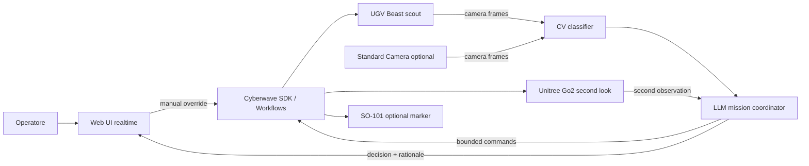

# Requisiti MVP Cyberwave Hackathon

## Executive Summary

Obiettivo: costruire un MVP dimostrabile in hackathon che mostri cooperazione tra robot tramite computer vision e agenti LLM. Il sistema deve riconoscere oggetti mock in un'area controllata e classificarli come `mine`, `non_mine` o `dubbio`; in caso di dubbio deve richiedere una seconda osservazione da un altro robot o sensore.

Il valore della demo non e' la classificazione perfetta, ma la catena completa: percezione, decisione agentica, coordinamento multi-robot, supervisione umana e sicurezza operativa.

## Scope E Sicurezza

Questo MVP deve lavorare solo con oggetti mock e in ambiente controllato. Non deve essere presentato come sistema di rilevamento o disinnesco mine reale.

In scope:

- Riconoscimento visuale di oggetti preparati per la demo.
- Classificazione in tre stati: `mine`, `non_mine`, `dubbio`.
- Decisione LLM basata su frame, confidence, storico eventi e stato robot.
- Dashboard web per monitoraggio realtime e override umano.
- Controllo bounded dei robot tramite Cyberwave SDK, workflow o controller policy.
- Simulazione o dry-run quando hardware, rete o sicurezza non sono pronti.

Out of scope:

- Rilevamento di mine o ordigni reali.
- Disinnesco, contatto fisico con oggetti pericolosi o manipolazione autonoma non supervisionata.
- Autonomia non supervisionata in spazi pubblici o non delimitati.
- Garanzia di accuratezza su oggetti non visti in training o non preparati per la demo.

## Robot E Ruoli Proposti

### UGV Beast Rover

Ruolo consigliato: scout principale.

- Avanza in una corsia delimitata.
- Usa camera pan-tilt per acquisire frame della scena.
- Invoca il classificatore CV sui target davanti al rover.
- Si ferma sempre dopo ogni azione breve.

### Unitree Go2

Ruolo consigliato: secondo osservatore per casi `dubbio`.

- Si posiziona da una prospettiva diversa.
- Usa camera/LiDAR/telemetria per arricchire il contesto.
- Conferma o smentisce la classificazione iniziale.
- Esegue solo micro-missioni bounded, ad esempio "vai al waypoint di ispezione" o "fermati e osserva".

### SO-101 Robot Arm

Ruolo consigliato: P2 wow factor, non P0.

- Indica visivamente un oggetto mock sicuro.
- Sposta un marker o una bandierina su un'area gia' dichiarata sicura.
- Mostra manipolazione solo su props innocui e ben delimitati.

### Standard Camera

Ruolo consigliato: sensore stabile di fallback.

- Feed fisso per classificazione P0 se il rover non e' pronto.
- Vista overhead per validare le detections dei robot mobili.
- Sorgente dati piu' affidabile per la demo live.

## Architettura Logica



## Data Flow

1. Il feed camera produce frame RGB live.
2. Il modulo CV individua target e ritorna classe, confidence, bounding box e frame_id.
3. Il mission coordinator riceve detections, stato robot e regole di sicurezza.
4. Se la confidence e' alta, pubblica decisione `mine` o `non_mine`.
5. Se la confidence e' bassa o ci sono segnali contraddittori, pubblica `dubbio` e chiede una seconda osservazione.
6. Il secondo robot o una seconda camera acquisisce un frame da altra prospettiva.
7. Il mission coordinator produce decisione finale o mantiene `dubbio`.
8. La Web UI mostra feed, overlay, stato missione, log decisioni e comandi di override.

## Decision Model

Schema minimo di output del classificatore:

```json
{
  "frame_id": "cam-001-1710000000",
  "detections": [
    {
      "id": "target-1",
      "class": "mine",
      "confidence": 0.82,
      "bbox": [0.42, 0.55, 0.18, 0.12],
      "source": "ugv_front_camera"
    }
  ]
}
```

Schema minimo di output dell'agente:

```json
{
  "status": "dubbio",
  "risk_level": "medium",
  "rationale": "Il target ha forma compatibile ma confidence sotto soglia.",
  "next_action": {
    "robot": "go2",
    "command": "second_look",
    "constraints": {
      "max_distance_m": 1.0,
      "requires_human_confirm": true
    }
  }
}
```

Regole consigliate:

- `mine`: confidence >= 0.75 e nessun segnale contraddittorio.
- `non_mine`: confidence >= 0.75 per classe innocua.
- `dubbio`: confidence tra 0.40 e 0.75, frame degradato, occlusione, bounding box parziale o disaccordo tra due viste.
- `unknown`: nessun target rilevato o input non valido.

Le soglie sono parametri demo, da tarare su oggetti mock e lighting reale.

## Requisiti Funzionali

### P0 - Demo Minima

- Acquisire frame da almeno una camera Cyberwave o webcam collegata.
- Eseguire classificazione visuale su immagini statiche o frame live.
- Mostrare bounding box, classe e confidence in Web UI.
- Gestire i tre stati `mine`, `non_mine`, `dubbio`.
- Mostrare event log con timestamp, fonte frame, decisione e rationale.
- Consentire override umano: conferma, rigetta, stop missione.
- Integrare movimenti base bounded per robot mobili: avanti, indietro, rotazione sinistra/destra.
- Supportare modalita' dry-run senza inviare comandi fisici ai robot.
- Eseguire stop immediato prima e dopo ogni azione robotica.

### P1 - Interazione Multi-Robot

- Inviare automaticamente casi `dubbio` a un secondo osservatore.
- Usare Go2 o UGV da seconda prospettiva per acquisire un nuovo frame.
- Aggregare due osservazioni in una decisione finale o confermare `dubbio`.
- Visualizzare quale robot ha prodotto quale osservazione.
- Limitare ogni comando robotico a una distanza/rotazione breve e validata.
- Registrare nel log la catena decisionale completa.

### P2 - Wow Factor

- Usare SO-101 per indicare un oggetto mock o posizionare un marker sicuro.
- Disegnare una mini-mappa missione con target e stato per area.
- Salvare replay o dataset di frame + decisioni per training successivo.
- Attivare un workflow Cyberwave low-code per alert, routing o registrazione.
- Integrare voce: "ispeziona l'oggetto dubbio" o "ferma tutti i robot".

## Requisiti Non Funzionali

- Latenza P0: decisione visiva entro 2 secondi da frame statico, entro 5 secondi nel loop live.
- Latenza P1: seconda osservazione completata entro 15-30 secondi in demo controllata.
- Safety: ogni comando autonomo deve essere bounded e reversibile; stop manuale sempre visibile.
- Robustezza: se il modello, il feed o Cyberwave falliscono, UI deve mostrare errore e passare in dry-run/manuale.
- Audit: tutte le decisioni devono essere tracciate con input, output e rationale sintetico.
- Privacy: evitare volti del pubblico nel feed; usare zona demo o frame crop.

## Web UI

Vista consigliata:

- Header con stato missione: `idle`, `scanning`, `needs_second_look`, `confirmed`, `manual_stop`.
- Pannello video principale con bounding box e label.
- Pannello robot: UGV, Go2, SO-101, camera fissa, stato online/offline e modalita' `live/sim/dry-run`.
- Switch modalita' simulata/fisica: in simulazione i comandi vanno ai twin virtuali e la UI usa la camera PC; in fisico i comandi puntano ai robot reali e la UI usa le camere onboard/robot.
- Event log append-only.
- Pannello decisione: classe corrente, confidence, rationale, prossima azione.
- Controlli: `Start Scan`, `Request Second Look`, `Confirm Mine`, `Mark Non Mine`, `Move Forward/Backward`, `Rotate Left/Right`, `Stop All`, `Dry Run`.

## Agent Prompting

L'agente LLM non deve decidere liberamente comandi raw. Deve scegliere da un vocabolario ristretto.

Azioni consentite P0/P1:

- `scan_area`
- `move_forward`
- `move_backward`
- `rotate_left`
- `rotate_right`
- `request_second_look`
- `hold_position`
- `mark_suspected_mine`
- `mark_non_mine`
- `stop_all`
- `ask_human`

Regole prompt:

- Non inventare sensori non presenti.
- Non superare i limiti di movimento forniti dal controller.
- Se il dato e' incompleto, scegliere `dubbio` o `ask_human`.
- Non proporre contatto fisico con target classificati `mine` o `dubbio`.
- Restituire sempre JSON validabile.

## Implementazione Consigliata Per Hackathon

### Percorso Rapido

1. Preparare 20-50 immagini di props mock: mine, non_mine, casi ambigui.
2. Usare un classificatore veloce: YOLO custom se gia' pronto, zero-shot VLM se dataset non pronto, o regole su marker visivi per demo iniziale.
3. Costruire Web UI che legge frame e decisioni da backend.
4. Integrare Cyberwave SDK per `get_frame()` e comandi bounded.
5. Aggiungere agente LLM come coordinator solo dopo che CV e UI sono stabili.
6. Abilitare Go2/UGV second look in dry-run, poi in live con spazio libero.

### Cyberwave Hooks Utili

Fonti Cyberwave rilevanti:

- Il quickstart mostra `Cyberwave()`, `cw.twin(...)`, `cw.affect("simulation")` e `cw.affect("live")` per usare stesso codice su sim e hardware: [Cyberwave Quickstart](https://docs.cyberwave.com/overview).
- Il Python SDK espone `twin.get_frame()` con sorgenti cloud, edge, local e Zenoh: [Python SDK docs](https://docs.cyberwave.com/overview/tools/python-sdk.md).
- La camera integration supporta USB, IP, depth, infrared e stream realtime: [Cyberwave Cameras](https://docs.cyberwave.com/overview/cameras.md).
- Il Virtual Controller invia comandi risolti dalla controller policy via MQTT, utile per workflow voce/azione: [Virtual Controller node](https://docs.cyberwave.com/feature-reference/workflows/virtual-controller.md).

## Demo Script

### Demo P0

1. Operatore apre dashboard.
2. Camera fissa o UGV osserva tre oggetti mock.
3. Sistema rileva oggetto A come `non_mine` e lo marca verde.
4. Sistema rileva oggetto B come `mine` e lo marca rosso.
5. Sistema rileva oggetto C come `dubbio` e lo marca giallo.
6. Operatore mostra log e rationale.
7. Operatore preme `Stop All` per dimostrare controllo umano.

### Demo P1

1. Il target C resta `dubbio`.
2. L'agente propone `request_second_look`.
3. Go2 o UGV da seconda angolazione acquisisce un nuovo frame.
4. Il sistema fonde le osservazioni e decide `mine` o mantiene `dubbio`.
5. UI mostra le due immagini affiancate e il log di escalation.

### Demo P2

1. SO-101 indica il target sicuro o posiziona un marker su `non_mine`.
2. UI mostra replay della missione.
3. Operatore lancia un comando vocale o testuale: "ispeziona il dubbio".

## Criteri Di Successo

Successo minimo:

- Una demo end-to-end senza crash: frame, classificazione, UI, decisione, log.
- Almeno 3 oggetti mock classificati durante la demo.
- Almeno un caso `dubbio` gestito esplicitamente.
- Stop manuale funzionante e visibile.

Successo competitivo:

- Secondo robot coinvolto in modo reale o simulato ma chiaramente tracciato.
- Agente LLM produce rationale comprensibile e JSON validato.
- Dashboard pulita, con overlay e stato robot realtime.
- Il team racconta bene safety, bounded autonomy e human-in-the-loop.

## Rischi E Mitigazioni

| Rischio | Impatto | Mitigazione |
| --- | --- | --- |
| Hardware non disponibile o instabile | Alto | Dry-run e camera fissa come P0 |
| Rete Cyberwave lenta | Medio/Alto | Cache frame, modalita' local webcam, replay immagini |
| CV poco accurata | Alto | Oggetti mock ad alto contrasto, soglie conservative, stato `dubbio` |
| LLM produce comandi non validi | Alto | JSON schema, allow-list azioni, validatore, dry-run |
| Spazio demo affollato | Alto | Corsia delimitata, velocita' bassa, stop fisico/manuale |
| Troppe feature | Alto | Bloccare P0 prima di P1/P2 |

## Checklist Operativa

- [ ] Definire props mock per `mine`, `non_mine`, `dubbio`.
- [ ] Verificare camera principale e illuminazione.
- [ ] Verificare `get_frame()` o stream WebRTC.
- [ ] Preparare classificatore e soglie.
- [ ] Preparare Web UI con overlay e log.
- [ ] Implementare agente con output JSON validato.
- [ ] Testare dry-run.
- [ ] Testare stop manuale.
- [ ] Solo dopo: abilitare comandi robot live.

## Fonti

- [Cyberwave Quickstart](https://docs.cyberwave.com/overview)
- [Cyberwave Python SDK repository](https://github.com/cyberwave-os/cyberwave-python)
- [Cyberwave Python SDK docs](https://docs.cyberwave.com/overview/tools/python-sdk.md)
- [Cyberwave Cameras overview](https://docs.cyberwave.com/overview/cameras.md)
- [Cyberwave SO-101 natural language agent](https://docs.cyberwave.com/tutorials/so101-natural-language-agent.md)
- [Cyberwave UGV voice controlled tutorial](https://docs.cyberwave.com/tutorials/ugv-voice-controlled.md)
- [Cyberwave Go2 digital to physical tutorial](https://docs.cyberwave.com/tutorials/go2-digital-to-physical.md)
- [Cyberwave Virtual Controller node](https://docs.cyberwave.com/feature-reference/workflows/virtual-controller.md)
